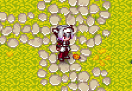

# Junolea Skin

How to install:

1. Go to the [releases](https://github.com/Inevitabilis/CC-Junolea/releases/latest) page
2. Under the "Assets" section press the link named "Source code (zip)"
3. Download the archive and unpack it into `CrossCode/assets/mods/`
4. Start the game, open inventory and find the "Add-Ons" tab (the rightmost one)
5. Select the "Junolea" skin
6. Enjoy!

## Authors

Inevitabilis recolored the sprites, dmitmel wrote the code.
